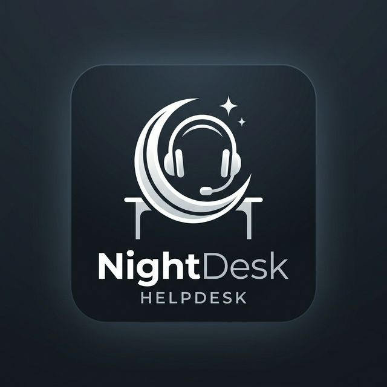

# Odoo Helpdesk - NightDesk

This repository contains the source code for the **NightDesk Helpdesk** module, a premium ticketing system built for Odoo 17.



## Overview

NightDesk Helpdesk is a comprehensive solution for managing customer support tickets with focus on efficiency, transparency, and automation.

## Key Features

- 🎫 **Full Ticket Lifecycle**: Track tickets from creation to resolution.
- 📂 **Smart Organization**: Categorize by type and priority for better workflow.
- 👥 **Agent Management**: Dedicated teams and agent assignment.
- ⏳ **SLA Management**: Configure and monitor Service Level Agreements.
- 🚀 **Advanced Escalation**: Automated rules to handle critical issues.
- 💬 **Integrated Mail**: Seamless communication through Odoo chatter.
- 📊 **Dynamic Dashboards**: Real-time insights into your support performance.

## Installation

1.  Clone this repository into your Odoo addons folder:
    ```bash
    git clone https://github.com/Nocturnailed-Community/OdooNightDesk.git
    ```
2.  Update your Odoo configuration file to include the module path.
3.  Restart your Odoo server.
4.  Activate the module from the Odoo Apps menu.

## Technologies

- **Odoo 17**
- **Python**
- **XML**
- **JavaScript (OWL)**
- **CSS**

## License

This project is licensed under the [LGPL-3](LICENSE) license.
